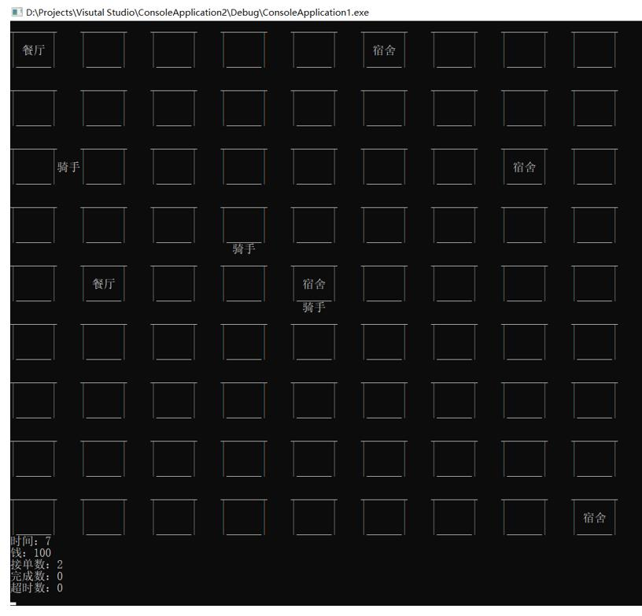
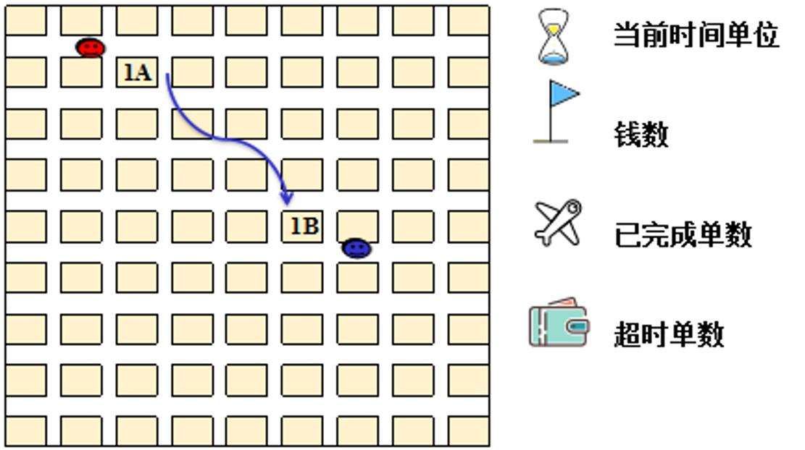
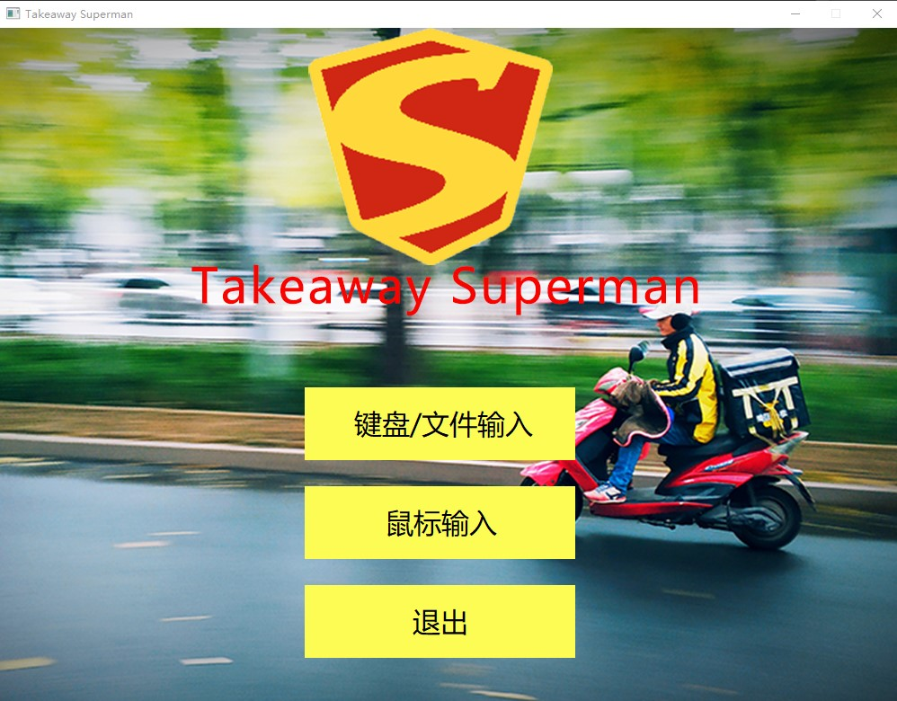
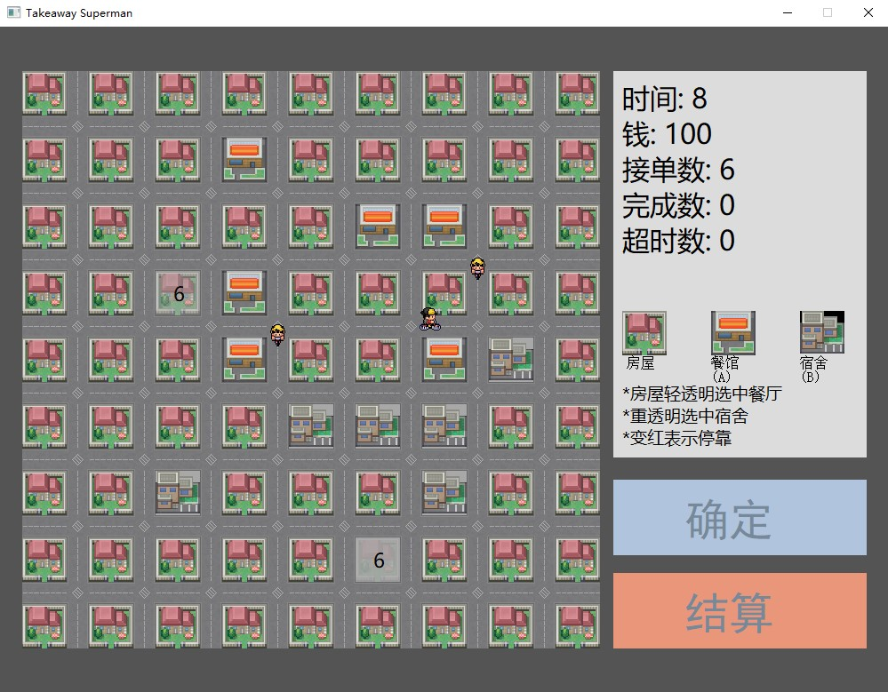
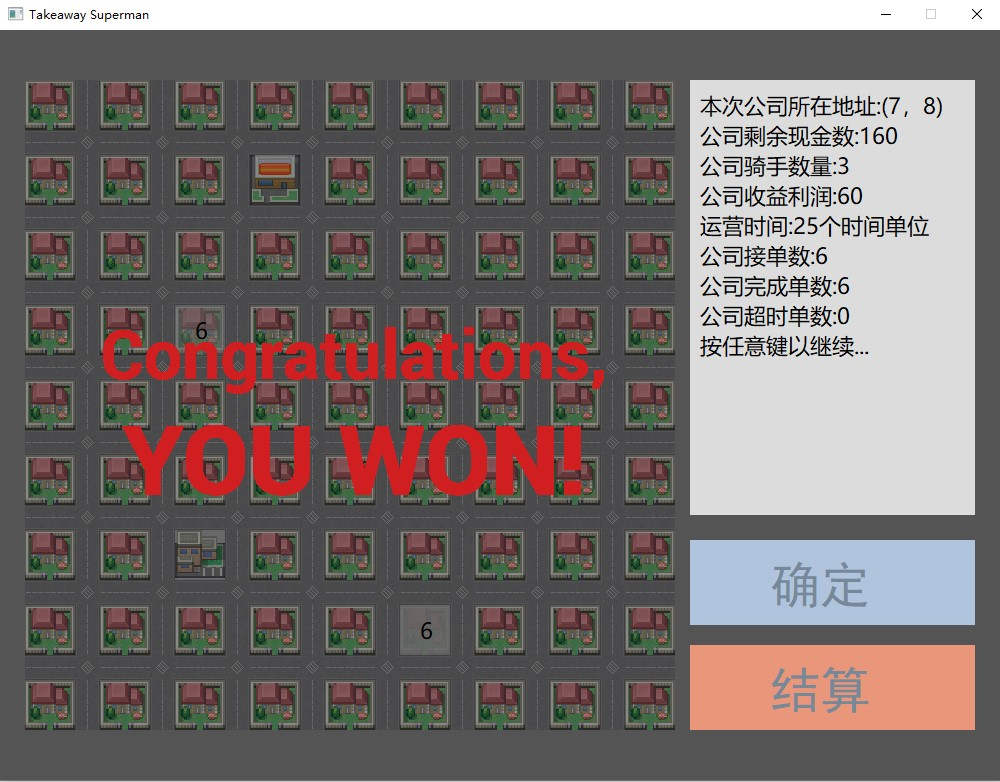

# Takeaway-Superman
>我就是传说中的    外     卖     超     人    ！

    在最开头，首先要感谢我的两位神仙队友@ JasonZhnag 和 @ KY-zhang-X 同学！
今天小学期终于完结了，凌晨4点还在战斗现在居然一点都不会困...<br>
本来想要好好写一下这个readme，感觉多半是要鸽了,具体题目要求我就放在下面,[不想看可以点此跳过](#该项目具体用法)：
***
```
课程设计-外卖派单模拟系统
计导课程设计-外卖派单模拟系统

版本时间：2019年5月22日v6

任务概述：
你开了一家外卖快递服务店,负责一个区域内的外卖订单接收和餐食快递.
你有一笔启动资金,可以招募外卖骑手帮你送餐,来赚取快递费.
但你也会面临风险,本区域的订单你都有义务接收,不能拒绝,若拒单政府就会吊销你的营业执照;
但如果接收多个订单后,因为骑手来不及送,导致某个订单超时未送达,客户会投诉,你会被罚款.

因此,你的任务就是制定聪明的调度策略,避免拒单被吊销营业执照（人工调度在订单高峰期可能会来不及接收），
避免因为罚款而破产,并且尽可能赚更多的钱.

收益利润=最终钱数+骑手成本-1000元.

规则一、负责的区域
你负责的外卖派送区域如图1所示：

```

```
约束1-1: 你的区域必须是一个9*9的方格，每格是一个房间，既可以是下订单的食客家，也可以是接单的餐馆。
约束1-2: 方格之间的8*8条街道是骑手唯一可走的道路；骑手停在方格的上下左右街道，即算抵达。
约束1-3: 每个方格的宽高都一样，即骑手走过每个方格的距离一样，速度也一样，
约定为骑手每走过一个方格花费1个时间单位，骑手从最左边直达最右边花费时间8个时间单位，即拐弯不花时间，经过路口不花时间。
每个时间单位暂定为2秒，后续可能会统一修改。
约束1-4: 为了记录房间和骑手位置，坐标系定为17*17，约定左上角的房间逻辑坐标为(0,0)，右下角房间的逻辑坐标为(16，16)。
横纵坐标一奇一偶的都是路，坐标都是偶数的是房间，坐标都是奇数的是路口。
规则二、外卖订单格式和输入方式
约束2-1: 你负责的外卖派送区域内，发起的任何订单都必须接收；
如果订单发起后，3个时间单位内没有派单给现有骑手，则视为拒单，你将被吊销营业执照，运营终止。
约束2-2: 外卖订单的信息格式是一个四元组(n序号,t下单时间,餐馆坐标,食客坐标);具体格式规范如下，必须按此规范执行。
（注：/表示前后数据分隔的含义，实际中不出现）
序号  下单时间  餐馆坐标x  餐馆坐标y  食客坐标x  食客坐标y 

约束2-3: 外卖订单的输入方式，要求一套程序支持以文本文件格式的输入方式，和鼠标操作的输入方式两种。两种方式不会同时生效。
文件输入方式：系统启动后检查当前目录下是否有标准文件名“sales.txt”,若有则自动进入订单强制文件输入方式。
sales.txt文件必须遵从约束2-2规定的文件格式。

鼠标操作方式：系统启动后检查当前目录找不到标准文件“sales.txt”,则自动进入订单强制鼠标输入方式。
系统运行期间，鼠标点中任意方格再拖拽至另一方格，即算完成从餐馆到食客的订单发起动作，系统必须实时记录并进行派单。
```

```
附加功能（不要求，同学们自己选作，属于加分项）: 从键盘输入，每个订单一行，格式见订单格式规范。注意:在控制台用Ctrl-Z键入EOF。

规则三、运营规则
约束3-1：系统开始运营时，你有1000$作为运营资本；
约束3-2：你必须有骑手才能接单，招聘一位骑手需投资300$; 只要你有钱，骑手数量不限；
在系统运营的整个期间，你都可以随时招聘骑手，但必须有足够的钱，不能拖欠；
约束3-3：招聘骑手的发起方式只能是两种方式，一种是你的调度程序自动发起，另一种是做成输入按钮，鼠标点击的方式发起。
你可以只实现一种，也可以两种都实现，两种都实现的好处是人工调度比自动调度聪明。
约束3-4：接单的方式只能是将其按顺序派给指定骑手。接单的操作可以是人工接单，也可以是程序按调度策略自动接单。
人工接单的操作比较复杂，需要用鼠标逐个选中现有未处理订单，将其分配给某个骑手。
约束3-5：所有骑手的初始位置必须是同一位置；但起始位置需要在你的程序中自行设定。
骑手初始位置的设定可以在程序中写死，也可以在系统启动时修改设置，两种均可。
注意：如果骑手初始在左上角，那么立刻接到一个(右下角>左上角)的订单时，可能超时。
约束3-6：每个订单从下单时间开始，要求在30个时间点内完成服务（先后抵达餐馆和食客家），否则算超时。
满30个时间点订单若没有完成结单，客户会投诉导致立刻罚款50$; 满60个时间点订单若没有完成结单，属于恶意废单立刻破产。
约束3-7：每完成一单且不超时，可收入10$。
约束3-8：无须考虑骑手负载限制，一位骑手可以带无限外卖；但超时未达要按约束3-6条处罚。
约束3-9：负债即破产！一旦破产，即刻停止运营，系统盘点每位骑手的接单数、完成数、超时数。
约束3-10：系统运营期间，至少每个时间单位更新一次，显示当前钱数、每位骑手的位置、接单数、完成数、超时数，具体细节见规则四。
规则四、输出方式
约束4-1: 第一版本要求文件输出和命令行输出两种同时实现；字符动画输出方式属于附加功能，即不要求，同学们自己选作，属于加分项。
约束4-2: 动画版本要求文件输出和图形界面输出两种同时实现。
a.文件输出规定: 文件名为output.txt，每个时间单位更新一次，格式如下：

时间：<时间单位,2s一个时间单位>

钱：<当前钱数>

接单数：<已接单数>

完成数：<已完成单数>；结单：<当前时间结单号,没有的话不写>；

超时数：<超时单数>；罚单：<当前时间被罚单号,没有的话不写>；

骑手0位置：9，8；停靠：<餐馆/食客/餐客><x><y>；//有停靠的话，用空格分割类型和坐标

骑手1位置：9，8；停靠：；//没有停靠就不写

骑手2位置：9，8；停靠：；

例1:

时间：12

钱：100

接单数：5

完成数：2；结单：3；

超时数：0；罚单：；

骑手0位置：9，8；停靠：食客 10 8；

骑手1位置：9，8；停靠：；

骑手2位置：9，8；停靠：；

例2:

时间：15

钱：120

接单数：6

完成数：3；结单：；

超时数：1；罚单：2；

骑手0位置：9，8；停靠：；

骑手1位置：7，6；停靠：餐馆 6 6 食客 8 6；

骑手2位置：9，8；停靠：；

例3:

时间：65

钱：320

接单数：38

完成数：30；结单：30 28；

超时数：1；罚单：2；

骑手0位置：9，8；停靠：餐客 8 8；

骑手1位置：7，6；停靠：餐馆 6 6；

骑手2位置：12，7；停靠：食客 12 8；

b.命令行输出规定: 和文件输出格式相同，但每发生停靠时才输出更新一次。也可用字符图形的效果代替文字形式的骑手坐标输出，力求直观，
但字符动画属于附加功能，不要求。

```


```
c.动画输出规定：在图形窗口中绘制房间、道路，动态显示骑手位置变化，停靠餐馆或食客时要有明显变化；
并在窗口中实时刷新显示钱数、接单数、完成数、超时数。
```

```

规则五、技术框架
约束5-1：程序代码主体必须是C语言编写。
约束5-2：界面部分，允许使用C++的动画包。
约束5-3：主干代码不允许抄袭，无论是来自互联网或者其他设计人员。
建议：派单的基础策略
策略x-1：首先按下单时间顺序，将新订单放入待处理队列。
策略x-2：根据骑手数量，将区域划分为几块，分给每个骑手，注意预先保留一个跨区域订单骑手。
策略x-3：派单时，从待处理队列取出队首订单，判断属于哪个区域，就分给哪个骑手，分派后此单出待处理队列，加入对应骑手的待送达队列；
餐馆和食客不在一个区域的订单，分给跨区域骑手。
策略x-4：当跨区域骑手的待派送队列中元素超过预警值时（例如10个），再分出一个骑手作跨区域骑手，剩下骑手重新划分区域，
更改仅对后续订单生效，已分配订单受影响。注意：预警值是你自己在程序中设定的，根据经验设置。
策略x-5：所有单派完后，开始轮流对所有骑手的待派送队列进行优化。优化策略是：取出队首订单，作为当前目标点；
计算骑手当前位置和当前目标点的区域范围，然后扫描队列后续订单中的所有可达目标点（见后续解释），筛选出属于此区域内的，设计出合理的行走路线，
只要按此路线当前目标点不超时，即可插入到队首目标点之前。
为了完成上述优化策略，骑手的待派送队列要把每个订单拆成A、B两个任务，每个元素都包含订单号、A或B标志，坐标位置点，下单时间，是否可达，这五个数据。
A任务没有约束条件，任何时间都属于可达目标点；B任务，默认不可达，只有在A任务完成时，扫描队列将A任务对应订单号的B任务改为可达。
策略x-5附加动作：当骑手的当前位置抵达待派送队列队首元素，队首元素出队，执行任务撤销处理，若是A任务，修改队列中对应B任务为可达;
若是B任务，计算是否超时，超时罚款，最后将该骑手的完成订单数+1。
任务检查阶段要求
阶段一、设计阶段

检查时间：本学期第10周规定的截止日期

检查内容：小组的《外卖派单模拟系统概要设计》v1

提交到爱课堂的文件：组号_组员姓名_外卖派单模拟系统概要设计_版本号

阶段二、功能检查阶段

检查时间：本学期第12-13周规定的周末半天，统一在机房由助教现场检查。

检查内容：外卖派单模拟系统基础原型，要求实现派单和模拟骑手送达的运营主体功能，不包含图形界面，仅文件输入+命令行输出的外观形式。

提交到爱课堂的文件：组号_组员姓名_外卖派单模拟系统基础原型_版本号 (打成一个压缩包)

阶段三、最终验收阶段

检查时间：本学期第16周规定的周末半天，统一在机房由助教现场验收。

检查内容：外卖派单模拟系统动画版，要求实现包含图形界面和鼠标操作的外卖派单系统完整功能，支持鼠标操作+窗口动画显示的外观形式。

提交到爱课堂的文件：组号_组员姓名_外卖派单模拟系统动画版_版本号 (打成一个压缩包)

任务验收标准
1、以小组为单位完成上述任务要求，按时提交概要设计文档，按时参加验收并提交可运行的程序。最终成绩由设计分+程序实现分两部分组成，比例待定。

2、程序实现分数包括三部分：功能分60%，策略分20%，界面交互友好分20%。

其中，任务书中要求遵守的规则和实现的派单功能都正确完成，可得60分，否则酌情扣分；

本任务的策略是开放的，各组自己设计派单策略，如何评价策略好坏呢？那就是在统一的文件输入订单集条件下，看各组派单运营结果，
吊销营业执照最低，破产次之，然后是各组最终赚钱数越多越好。

界面交互友好分，主要看操作友好度、界面美观度和信息完整度，友好的外观是需要好的用户交互设计，和许多的代码来支撑的。
所以，这部分也值20分，拿到满分可不容易。

3、最终验收时小组成员必须参加，并汇报各自工作量。程序验收分数是小组分，个人分则需要按多劳多得的原则在小组分上加减生成。

（1）若个人工作量达到小组平均，即不加不减。例：3人组，工作量33%就是平均；2人组，工作量50%就是平均。

（2）若个人工作量≤15%，直接不及格。

（3）若个人工作量超过小组平均的一半，加小组分的8%，但100是上限。

（4）若个人工作量少于小组平均的一半 且 >15%，扣小组分的10%。
```
***
##  该项目具体用法
首先，你需要Visual Studio 2019并且安装ege图形库[ege图形库](http://xege.org/),按照vs2017的标准安装即可<br>
下载该项目后，直接运行`外卖超人vs2019`中的`外卖超人.sln`，便能直接打开整个项目
##  懒得下载Visual Studio？
Ohhhh!!!<br>
都能看到这了，你的电脑里居然还没有宇宙第一IDE？<br>
那我只好带你*云编译*一手我们无敌的**Takeaway Superman**<br>
<br>
直接上运行图

你知道这帅气的图标，飘逸的背景，是我花了整整一晚上~~百度~~慢慢P出来的吗？<br>
~~其实是队友在敲代码，我在划水哒~~<br>

控制台界面，没什么好说的，牛逼的ZBC写出了强大的字符画，而且会动哦

说实话这一块我真的没多少参与，感谢两位大佬扶持

今天早上演示的最帅的结束页面，没有之一（大家自己跑程序的时候还有bgm可以听（大概））
##  写在后面
其实说了这么多，感觉爆肝做完这个大作业，收获真的很多，至少第一次基本知道了git的用法^_^ <br>
>不过印象最深的还第一次看着沙河的太阳在眼前升起<br>

如果你要问我在做完整个项目后的现在的感想<br>
那么我的答案肯定是：<br>
**徐老师ballball你高抬贵手，给个高分吧/(ㄒoㄒ)/~**


